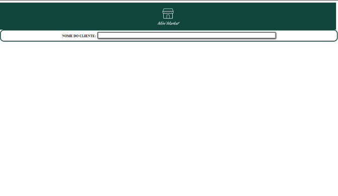
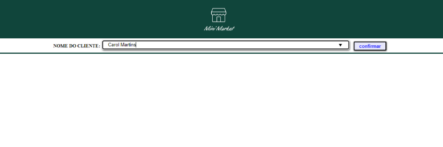
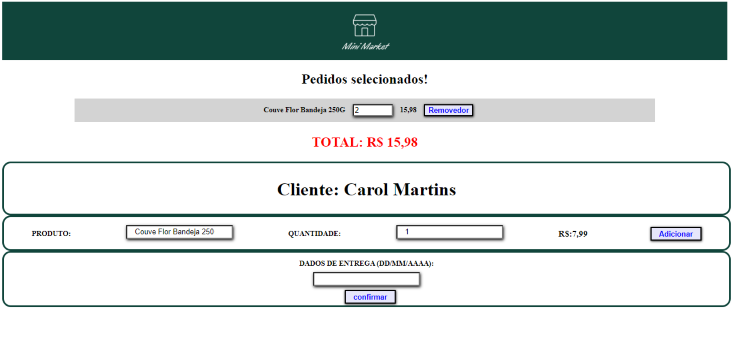
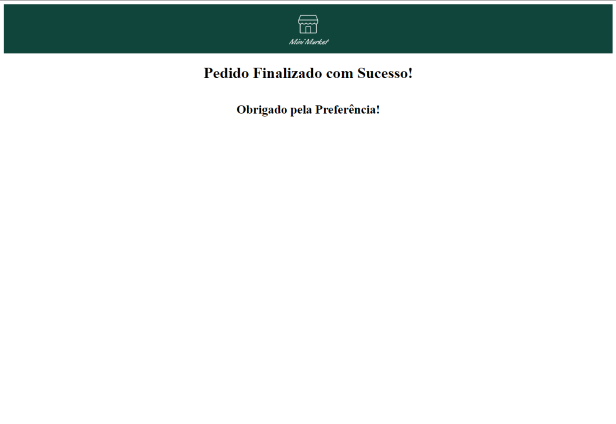

# Case_Full-Stack
## Baseado em um teste técnico de desenvolvimento de software.
---
### Descrição do case:

Você vai criar um formulário simples de cadastro de pedidos de supermercado. O sistema deve ser
escrito em Python ou Javascript (node.js e/ou react.js). 
Além da funcionalidade, avaliaremos principalmente organização e clareza no código, lembre-se
que um programador lê mais código do que escreve, então códigos limpos e bem estruturados
facilitam a vida de todos. 
Recebemos uma lista de produtos disponíveis e seus respectivos preços e estoque com as seguintes definições:

**id = id do produto name = nome do produto price = preço do produto em reais qty_stock = quantidade em estoque **

*
Abaixo esta listado os requisitos que seu sistema deve atender:
*

1- O sistema deve ter um formulário de cadastro de pedidos 

2- O usuário deve entrar com Nome do Cliente, Data de Entrega e uma lista de compras 

3- A lista de compras é composta por um ou mais produtos e a quantidade solicitada para
cada um deles. 

4- O usuário pode alterar a quantidade de itens já cadastrados ou excluir um item que ele
não queira mais. 

5- A cada alteração na lista de compras o sistema deve calcular o valor total do pedido. 

6- Todas essas informações devem ser salvas em um banco de dados que você vai modelar. 

7- Cada pedido salvo deve debitar a quantidade do produto correspondente de seu estoque. 

8- O sistema deve alertar o usuário caso a quantidade solicitada não esteja disponível no
estoque. 

9- O sistema também deve ter uma função para mostrar o estoque atual exibindo: Nome do
produto e a quantidade em estoque.

---

### Documentação:

**[Documentação Postman](https://documenter.getpostman.com/view/24706667/2s8ZDU6Pxp)**

---

### Link Render:

**[RENDER](https://full-stack-5o0a.onrender.com)**

---

### Link Surge com deploy:
**[SURGE](https://greasy-reading.surge.sh/)**

---
### Como Testar:
*BACKEND*
- npm install;

- conectar ao seu banco de dados configurado como 
ARQUIVO **.ENV**
DB_HOST= 
DB_USER= 
DB_PASSWORD=
DB_DATABASE=

- **npm run migrations**(vai criar as tabelas e popular tabela de produtos.);

- **npm start**(vai conseguir testar em postman ou no próprio request.rest que contém no arquivo);

*FRONTEND*
- npm install;

- BASE_URL está com a url do render feita por mim, mas pode ser trocada pelo localhost(pasta constants arquivo BASE_URL);

- npm run start.
---
### Prints
#### OBS: prints feitos com **surge**.

**- ao abrir site**

**- ao inserir nome já cadastrado**

**- ao inserir novo cliente e fazer pedido**

**- ao finalizar pedido mensagem de sucesso!**

